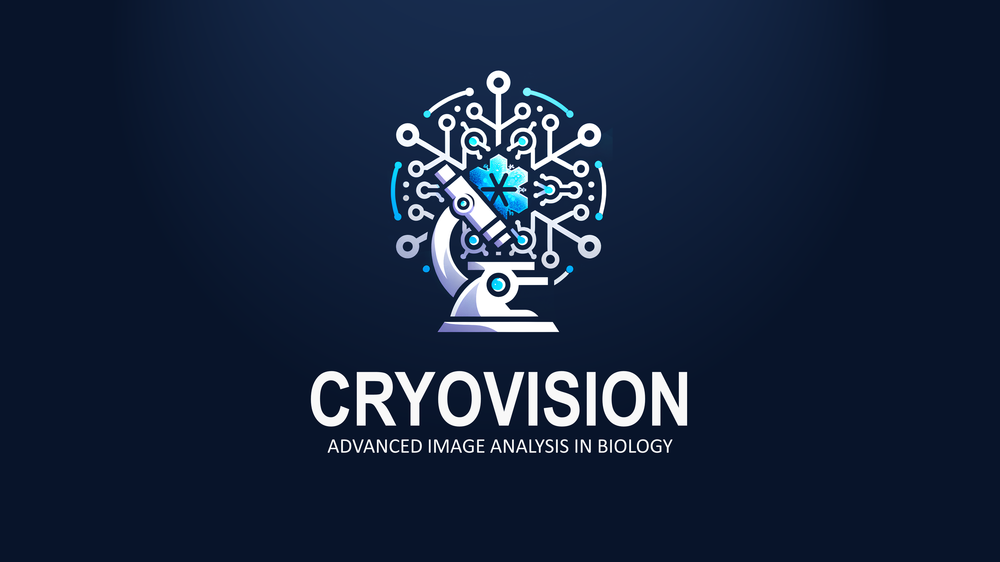
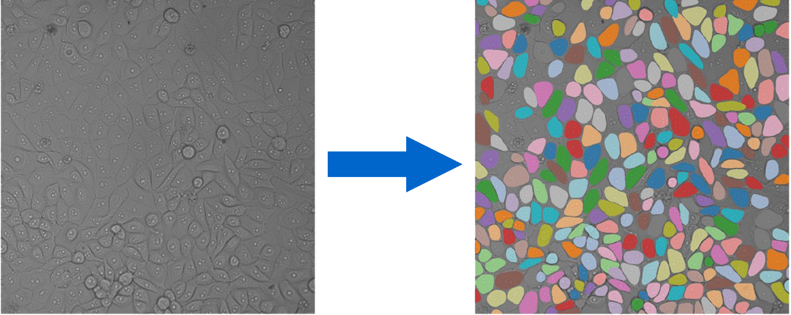
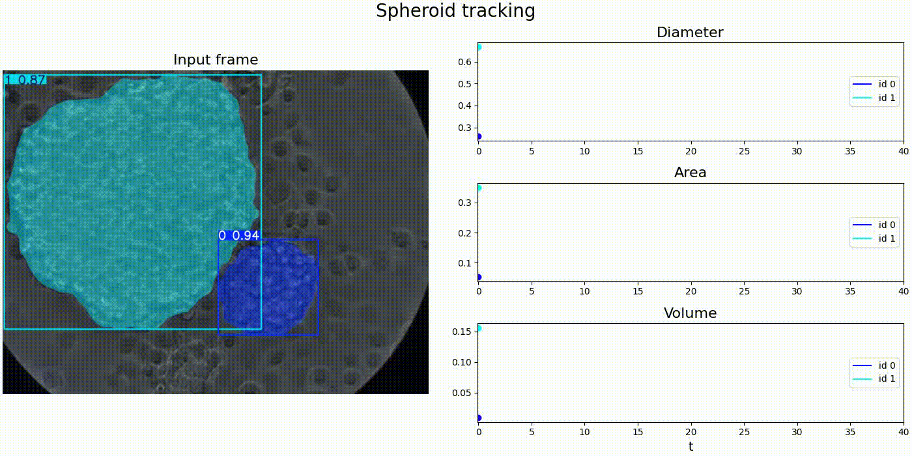
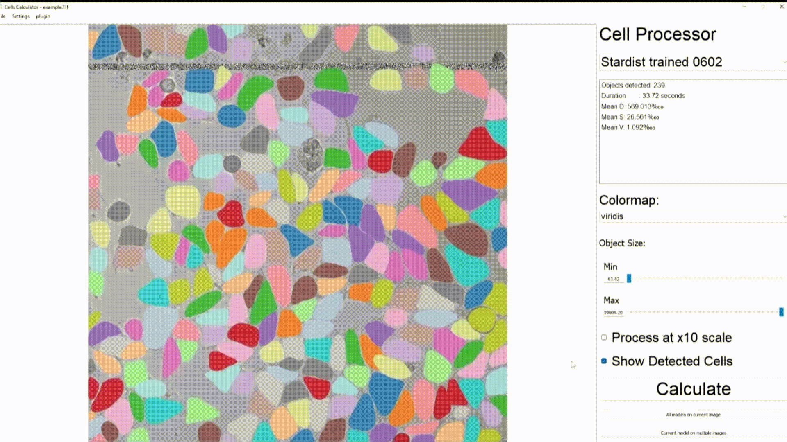

# CryoVision

<!-- Placeholder: A clean, modern banner showing UI + microscopic image overlay -->

---

## 🚀 What is CryoVision?

**CryoVision** is an AI-powered software platform for **automated analysis of microscopic cell images**.

We eliminate one of the biggest bottlenecks in modern biotech:
>slow and error-prone manual cell analysis

With CryoVision, researchers can process complex 2D and 3D cell cultures **in seconds instead of hours**, unlocking faster discoveries in medicine, drug development, and bioengineering.

---

## ⚡ Why CryoVision?

### The Problem
- ⏳ Up to **10 hours** to analyze a single image manually  
- 🎯 Only ~**80% human accuracy**  
- 🧠 Scientists wasting time on repetitive work instead of research  
- 🧬 3D cell structures are **extremely difficult to analyze manually**

---

### Our Solution

CryoVision is a **ready-to-use AI application** that:
- 🔍 Automatically **segments cells** and **tracks spheroids**
- 📊 Extracts morphology (area, diameter, volume)  
- 🧠 Builds **3D spheroid reconstructions**  
- ⚡ Processes images **in under 1 second**  
- 💻 Runs on **entry-level laptops (no GPU required)**  

---

## 💡 Key Advantages

- 🚀 **Up to 7,000× faster** than manual analysis  
- 🎯 **85.2% accuracy** with consistent results  
- 🔁 Fully reproducible (no human bias)  
- 🔧 Works across different cell lines & setups  
- 📈 Scales from small experiments to high-throughput screening  

---

## 🧪 What Can It Do?

### 🔬 2D Cell Segmentation

<!-- Placeholder: Before/after image showing segmentation masks -->

---

### 🔬 2D Spheroid Morphology Tracking

<!-- Placeholder: Before/after image showing segmentation masks -->

---

### 🧬 Z-Stacks - 3D Spheroid Images

<!-- Placeholder: 3D model visualization of spheroid -->

---

### 🧬 3D Spheroid Analysis

<!-- Placeholder: 3D model visualization of spheroid -->

---

### ⚙️ User-Friendly UI

<!-- Placeholder: Diagram: Input image → AI → Metrics + Visualization -->

---

## 🏗️ How It Works

CryoVision combines modern AI and computer vision techniques:

- 🧠 Deep-learning-based **instance segmentation**
- 🔗 Custom **object tracking algorithm**
- 📐 Morphological feature extraction
- 🧩 Modular architecture for scalability

All wrapped in a **simple, user-friendly interface** — no coding required.

---

## *ColdBlooded* - the Team

We are a team of enthusiastic students from the NTU "KhPI":
* **Ye. Ponomarov** - *Team-Lead, ML Engineer*
* **S. Lytvynenko** - *ML Engineer*
* **K. Noskova** - *ML Engineer*
* **M. Borysenko** - *Documentation, Data Labelling*

Our team also deeply appreciates continuous support from our mentors whose consultancies have made our journey much easier:
* **M. Tatariants** - *Senior Lecturer at the Department of Computer Mathematics and Data Analysis, NTU "KhPI"*
* **G. Bozhok** - *Senior Researcher at the Institute for Problems of Cryobiology and Cryomedicine of the NASU*

## Contact Us

Feel free to reach out to us at Oleksii.Haluza@khpi.edu.ua 