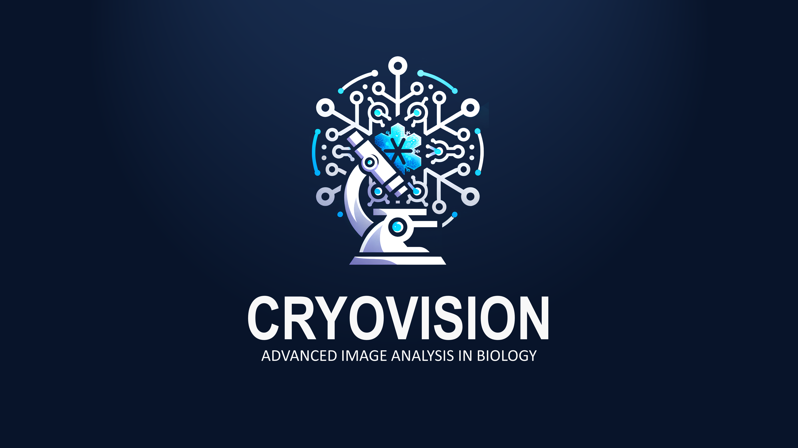
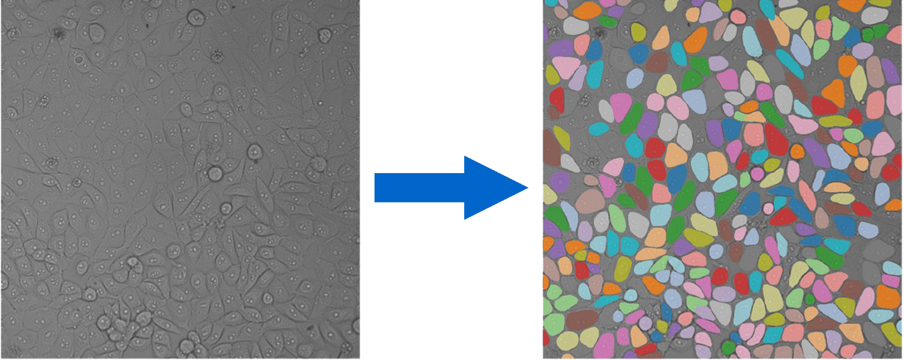
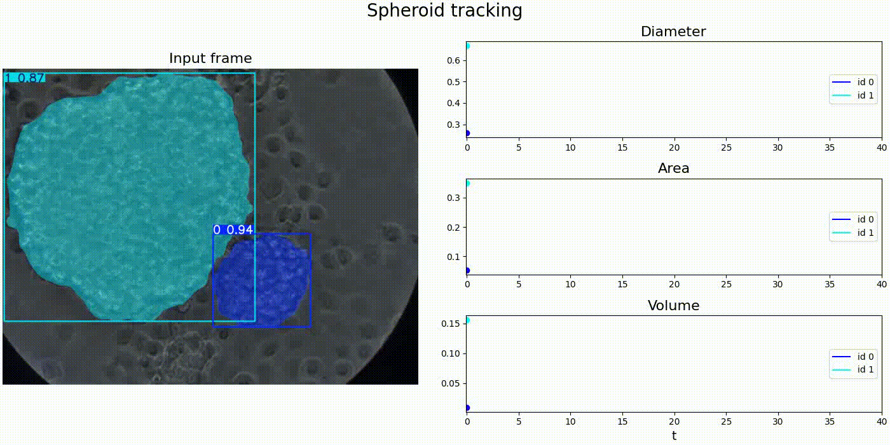
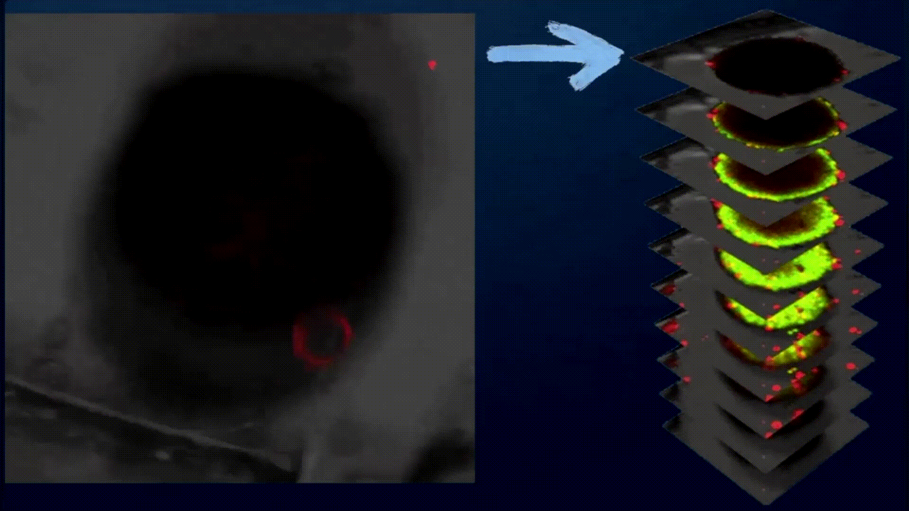
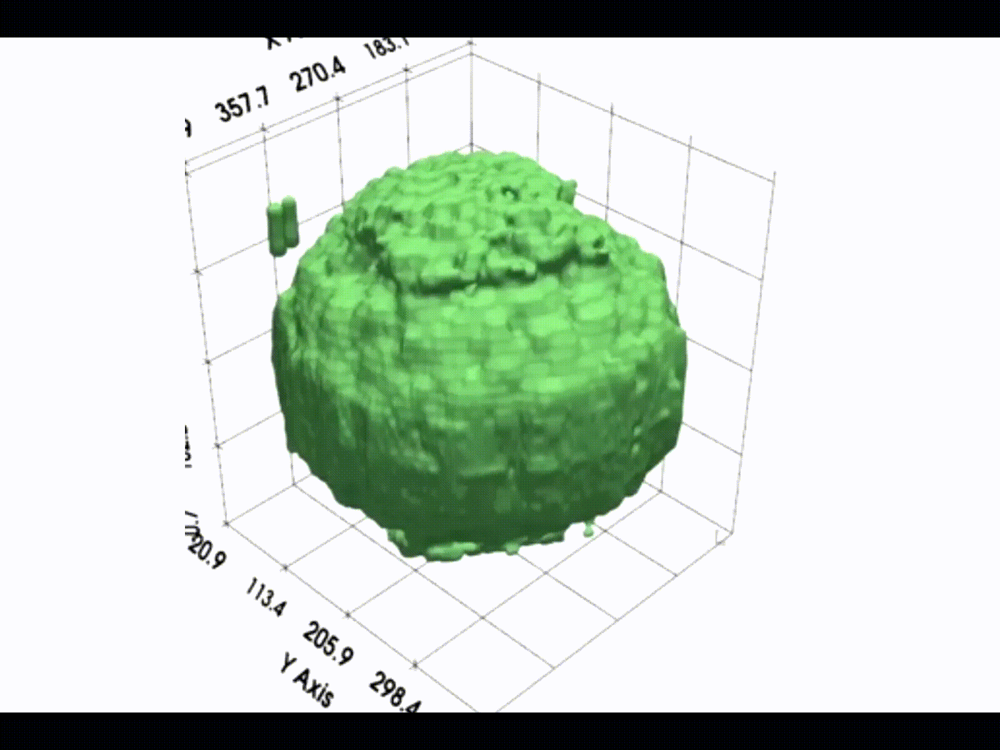
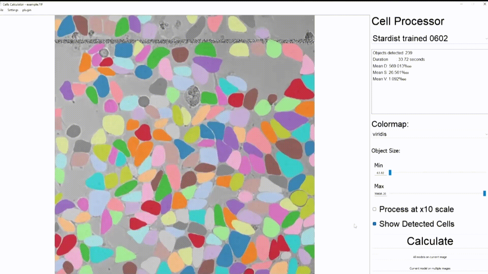

# CryoVision



---

## 🚀 What is CryoVision?

**CryoVision** is an AI-powered software platform for **automated analysis of microscopic cell images**. Formerly known as the **CellsCalculator** project, it has been refactored and improved to provide even better performance and user experience.

We eliminate one of the biggest bottlenecks in modern biotech:
>slow and error-prone manual cell analysis

With CryoVision, researchers can process complex 2D and 3D cell cultures **in seconds instead of hours**, unlocking faster discoveries in medicine, drug development, and bioengineering.

---

## ⚡ Why CryoVision?

### The Problem
- ⏳ Up to **10 hours** to analyze a single image manually  
- 🎯 Only ~**80% human accuracy**  
- 🧠 Scientists wasting time on repetitive work instead of research  
- 🧬 3D cell structures are **extremely difficult to analyze manually**

---

### Our Solution

CryoVision is a **ready-to-use AI application** that:
- 🔍 Automatically **segments cells** and **tracks spheroids**
- 📊 Extracts morphology (area, diameter, volume)  
- 🧠 Builds **3D spheroid reconstructions**  
- ⚡ Processes images **in under 1 second**  
- 💻 Runs on **entry-level laptops (no GPU required)**  

---

## 💡 Key Advantages

- 🚀 **Up to 7,000× faster** than manual analysis  
- 🎯 **85.2% accuracy** with consistent results  
- 🔁 Fully reproducible (no human bias)  
- 🔧 Works across different cell lines & setups  
- 📈 Scales from small experiments to high-throughput screening  

---

## 🧪 What Can It Do?

### 🔬 2D Cell Segmentation


---

### 🔬 2D Spheroid Morphology Tracking


---

### 🧬 Z-Stacks - 3D Spheroid Images


---

### 🧬 3D Spheroid Analysis


---

### ⚙️ User-Friendly UI


---

## 🏗️ How It Works

CryoVision combines modern AI and computer vision techniques:

- 🧠 Deep-learning-based **instance segmentation**
- 🔗 Custom **object tracking algorithm**
- 📐 Morphological feature extraction
- 🧩 Modular architecture for scalability

All wrapped in a **simple, user-friendly interface** — no coding required.

---

## Get the app

Should you want to try the **CryoVision** application, follow the guidelines below:
1. On project's GitHub main page, search for **Releases** section in the right menu;
![[Releases]](images/Screenshot_8.png)
2. Click on the latest release available;
3. In the opened release window, go to **Assets** section at the bottom and click on `CellsCalculator.zip` file archive;
![[Assets]](images/Screenshot_9.png)
4. Wait until the archive is completely loaded and then unpack it;
5. Download the models following the instructions and place them into the `models` directory;
6. Enter the automatically created `CellsCalculator` folder and run the `main.exe` file.
7. Enjoy the application!

Remember: it is forbidden to rename or change location of ANY elements within the **CellsCalculator** directory, as it may badly influence the application behaviour, up to its full crash with unpredictable errors on the way.

## Run the code

Should you want to run the raw application code, follow the guidelines below. Note that the prompts are designed for Windows CMD - for bash you may need to use other syntax:
1. Clone the repository using the prompt below:
```bash
git clone https://github.com/EugenTheMachine/CryoVision.git
```
2. Enter the folder in which the repo is cloned and set up your environment. To do that, you need to have Python 3.7 or above pre-installed. Install the required dependency packages by running:
```bash
pip install -r requirements.txt
```
3. To start the application, execute the ```main.py``` file - you can do that by running:
```bash
python main.py
```
4. Enjoy the application running!

## Contributors

**CryoVision** has emerged as a student project and was developed by the following team:

* **Ye. Ponomarov** - *Consultant, former Team-Lead, former ML-Engineer*;
* **S. Lytvynenko** - *Team-Lead, ML-Engineer*;
* **O. Kovalov** - *Tech-Lead*;
* **K. Noskova** - *ML-Engineer*;
* **R. Malakhov** - *ML-Engineer*;

Our team also deeply appreciates continuous support from our mentors whose consultancies have made our journey much easier:
* **M. Tatariants** - *Senior Lecturer at the Department of Computer Mathematics and Data Analysis, NTU "KhPI"*
* **V. Kolbasin** - *Senior Lecturer at the Department of Computer Mathematics and Data Analysis, NTU "KhPI"*
* **G. Bozhok** - *Senior Researcher at the Institute for Problems of Cryobiology and Cryomedicine of the NASU*

## Contact Us

Feel free to reach out to us at Oleksii.Haluza@khpi.edu.ua 
